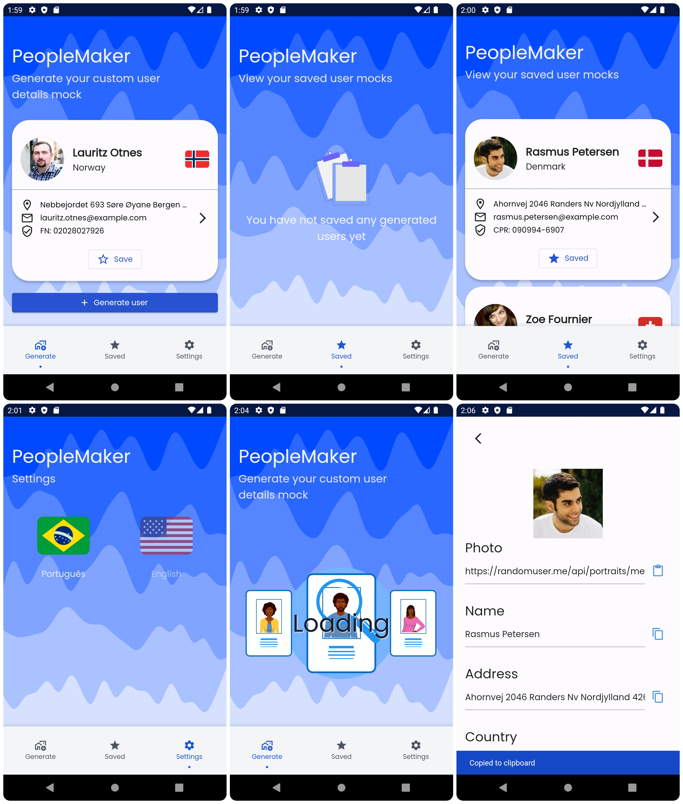

# People Maker

people_maker is a mobile application that uses the randomuser.me API to generate realistic user profiles. It aims to provide developers and designers with easy-to-copy user generated data for various purposes, such as testing, prototyping and design.



## Features

- Generate random user profiles with realistic data
- Save generated profiles for future reference
- Remove saved profiles
- Easily copy generated data for use in other applications
- Clean and simple user interface

## Getting Started

These instructions will help you set up the project on your local machine for development and testing purposes.

### Prerequisites
- Flutter SDK installed on your machine
- An IDE with Flutter support (e.g., VS Code, Android Studio, or IntelliJ IDEA)
- An Android or iOS emulator, or a physical device for running the app

### Installation

Install the dependencies:
```bash
flutter pub get
```

Run the app on an emulator or a physical device:
```bash
flutter run
```

## Built With

[Flutter](https://flutter.dev/) - The UI toolkit for building natively compiled applications

[randomuser.me](https://randomuser.me/) API - The API used for generating random user profiles

## Contributing

Contributions are always welcome! Feel free to fork the project, make changes, and create a pull request.
